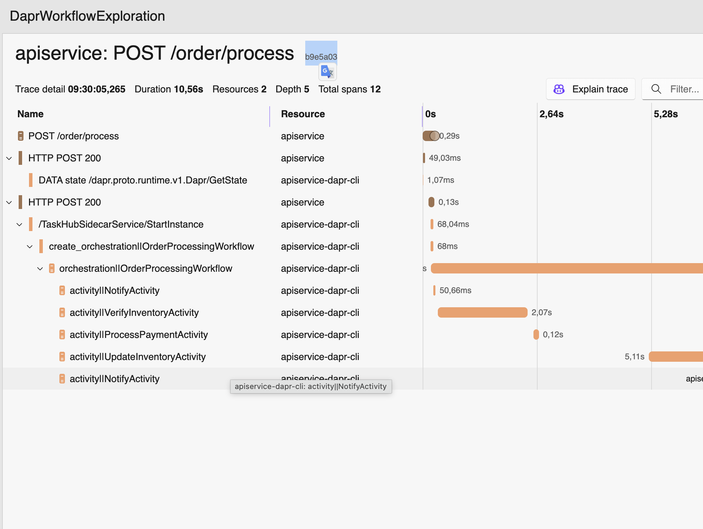
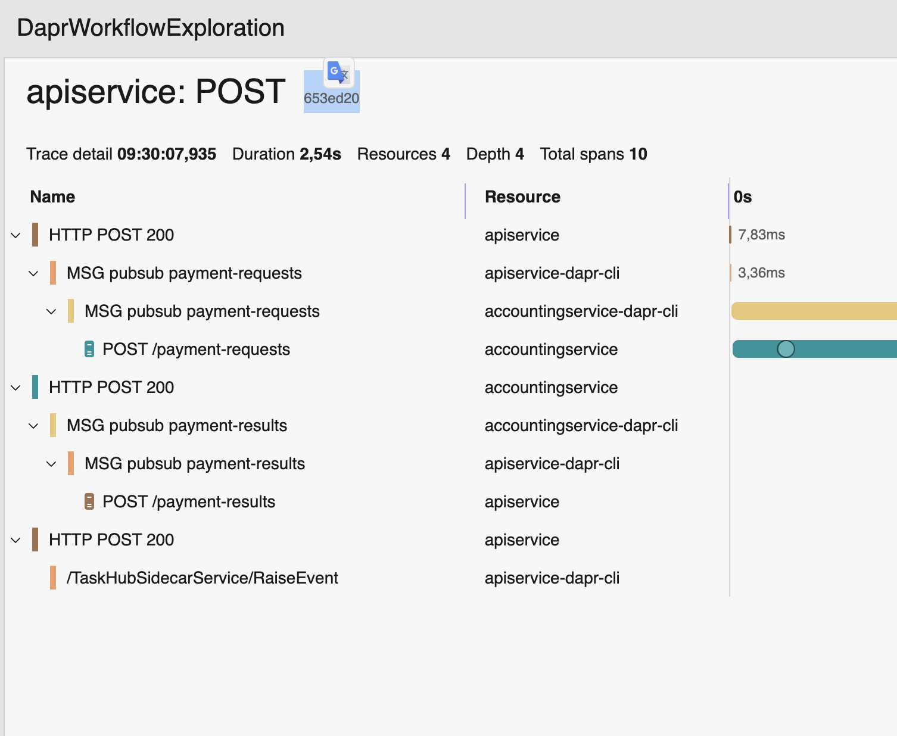

# Dapr Workflow Exploration

Small Aspire-based sample that reproduces a tracing/correlation question with `Dapr.Workflow`.

The sample shows that OpenTelemetry is configured and telemetry is emitted, but the workflow execution is not shown as one single end-to-end trace across:

- the workflow
- the workflow activities
- the downstream pub/sub processing

## Projects

- `DaprWorkflowExploration.AppHost`: Aspire host that starts the app and Dapr sidecars
- `DaprWorkflowExploration.ApiService`: API + workflow orchestration
- `DaprWorkflowExploration.AccountingService`: subscriber that processes the payment request and publishes the result
- `DaprWorkflowExploration.Web`: simple frontend
- `DaprWorkflowExploration.ServiceDefaults`: shared Aspire/OpenTelemetry configuration

## Prerequisites

- .NET 8 SDK
- Dapr CLI installed
- Docker running

Initialize Dapr locally if you have not done that already:

```bash
dapr init
```

## Run

Start the Aspire app from the repository root:

```bash
dotnet run --project DaprWorkflowExploration.AppHost
```

This starts:

- `apiservice` on `http://localhost:5497`
- `webfrontend` on `http://localhost:5498`
- `accountingservice` on `http://localhost:5499`
- the Aspire dashboard

## Reproduce With The HTTP File

Use [`OrderProcessing.http`](./OrderProcessing.http).

Suggested sequence:

1. Run `POST /store`
2. Run `POST /order/process`
3. Copy the `workflowInstanceId` from the response
4. Run `GET /order/process/{workflowInstanceId}` until the workflow completes

The HTTP file also includes requests for:

- getting a single store item
- listing all store items

## Expected Behavior

The expectation is that the complete order flow is visible as one trace, including:

- the request that starts the workflow
- workflow execution
- workflow activities
- downstream pub/sub processing in `AccountingService`
- the event raised back to the workflow

## Actual Behavior

Metrics, logs, and traces are emitted, but the spans are split across separate traces instead of appearing under a single end-to-end trace for the whole workflow process.

## Screenshots

The Aspire dashboard makes the split visible:

### Workflow trace
First tace `POST /order/process` together with the workflow orchestration and activity spans


### Pub/sub and RaiseEvent trace split
Another trace shows the pub/sub flow for `payment-requests` and `payment-results`


These screenshots shows that telemetry exists, but trace continuity across the full workflow lifecycle is missing.

## Relevant Files

- [`OrderProcessing.http`](./OrderProcessing.http)
- [`DaprWorkflowExploration.AppHost/AppHost.cs`](./DaprWorkflowExploration.AppHost/AppHost.cs)
- [`DaprWorkflowExploration.ApiService/Program.cs`](./DaprWorkflowExploration.ApiService/Program.cs)
- [`DaprWorkflowExploration.AccountingService/Program.cs`](./DaprWorkflowExploration.AccountingService/Program.cs)
- [`DaprWorkflowExploration.ServiceDefaults/Extensions.cs`](./DaprWorkflowExploration.ServiceDefaults/Extensions.cs)
